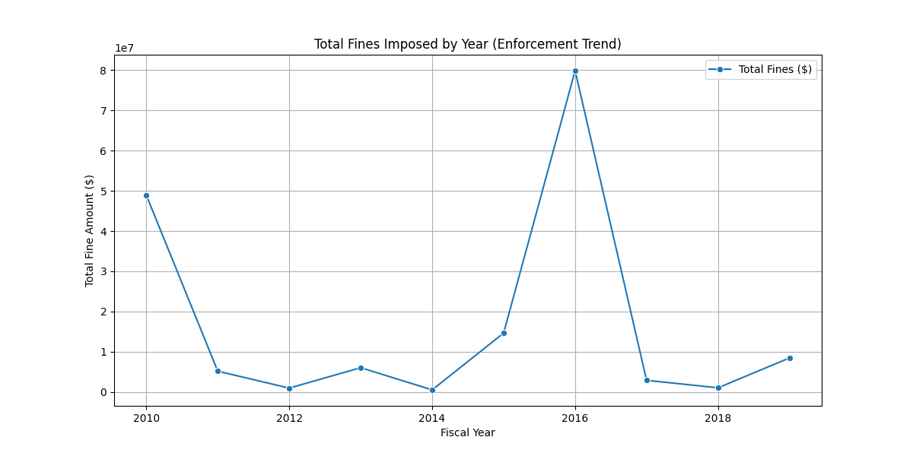
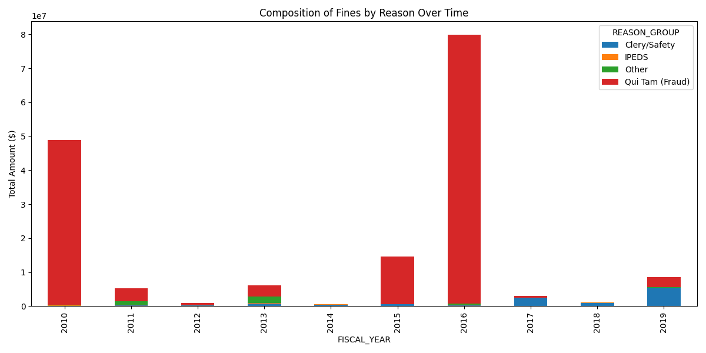
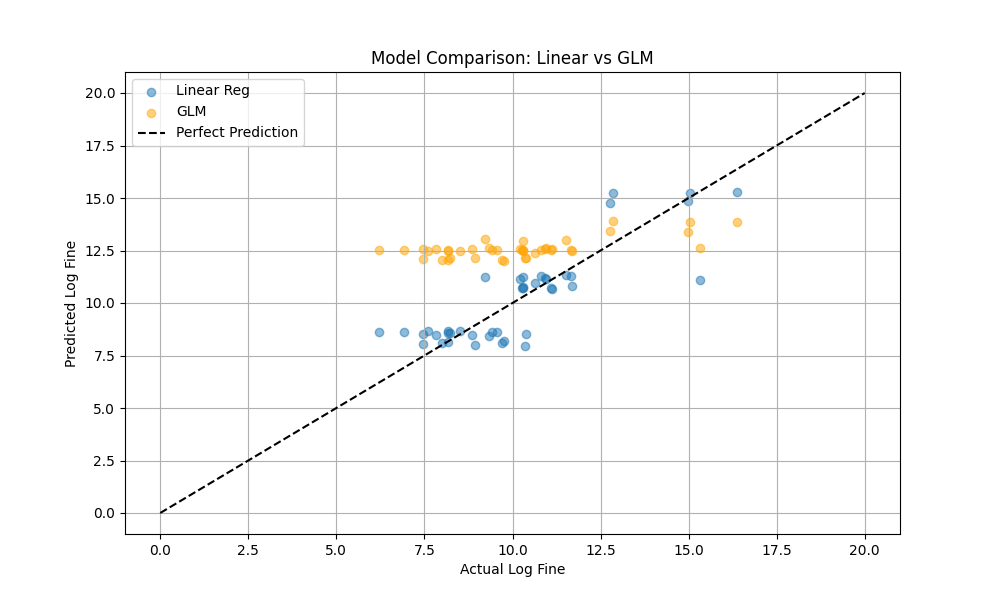
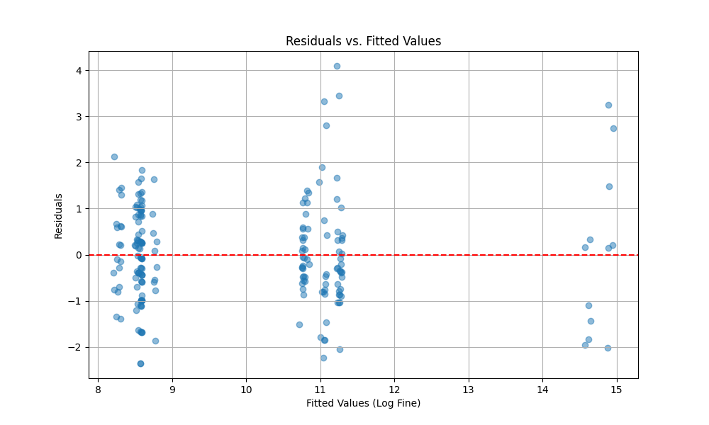
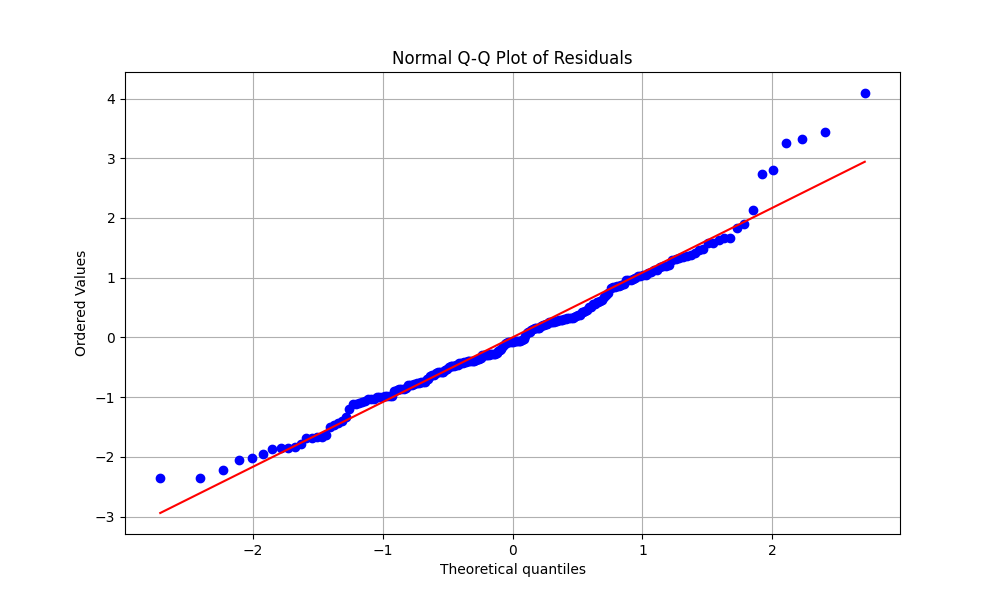
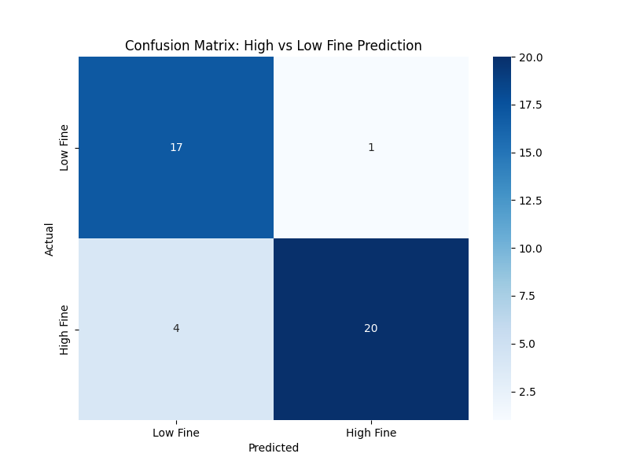

# Federal Student Aid Enforcement Fines Analysis (FY2010-FY2019)

A data science project that cleans and integrates 10 years of U.S. Department of Education fine records, analyzes enforcement trends, and builds predictive models for fine magnitude and fine-risk classification.

## Project Snapshot

- **Domain:** Higher-education compliance enforcement
- **Time span:** Fiscal Year 2010 to 2019
- **Primary target (regression):** Fine amount (log-transformed and raw)
- **Secondary target (classification):** High fine vs low fine (median split)
- **Core methods:** Trend statistics, Linear Regression, SVR, Tweedie GLM, Logistic Regression

## Repository Contents

- `main.py`: End-to-end pipeline (load, clean, analyze, model, visualize)
- `FY10.csv` ... `FY19.csv`: Annual enforcement datasets
- `school-fine-report.xls` / `school-fine-report.xlsx`: Source report files
- Generated figures:
  - `trend_analysis.png`
  - `reason_analysis.png`
  - `model_comparison.png`
  - `residuals_vs_fitted.png`
  - `qq_plot.png`
  - `confusion_matrix.png`

## Methodology

### 1) Data Preparation

- Loads yearly CSV files and standardizes schema across format differences.
- Converts Excel serial dates into calendar dates.
- Cleans currency values into numeric fine amounts.
- Harmonizes school type categories.
- Maps raw referral text into grouped reasons:
  - Clery/Safety
  - IPEDS
  - Drug Prevention
  - Qui Tam (Fraud)
  - Other

### 2) Statistical and Trend Analysis

- Aggregates annual totals and counts.
- Runs a linear trend test over fiscal years.
- Tests school-type fine differences with Kruskal-Wallis.

### 3) Predictive Modeling

- **Regression (fine amount):**
  - Linear Regression (log fine)
  - SVR with RBF kernel (log fine)
  - Tweedie/Gamma-style GLM with log link (raw fine, compared on log scale)
- **Classification (risk):**
  - Logistic Regression for high-vs-low fine prediction

### 4) Diagnostics

- Residuals vs fitted plot
- Q-Q plot for residual normality
- Confusion matrix for classifier behavior

## Visual Results

### Enforcement Trend Over Time



### Fine Composition by Referral Reason



### Regression Model Comparison



### Linear Model Diagnostics

| Residual Behavior | Normality Check |
|---|---|
|  |  |

### Classification Performance



## How to Run

### 1. Create and activate a virtual environment (recommended)

### macOS / Linux

```bash
python3 -m venv .venv
source .venv/bin/activate
```

### Windows (PowerShell)

```powershell
python -m venv .venv
.venv\Scripts\Activate.ps1
```

### 2. Install dependencies

```bash
pip install pandas numpy matplotlib seaborn scikit-learn scipy
```

### 3. Run the pipeline

```bash
python main.py
```

The script will print metrics and regenerate all plots in the project root.

## Expected Outputs

After execution, you should have the following generated visual artifacts:

- `trend_analysis.png`
- `reason_analysis.png`
- `model_comparison.png`
- `residuals_vs_fitted.png`
- `qq_plot.png`
- `confusion_matrix.png`

## Notes and Assumptions

- The script is designed to tolerate minor schema differences across yearly files.
- Missing or malformed fine values are coerced to zero before filtering/modeling.
- Predictive models are trained on non-zero fines where fiscal year is available.